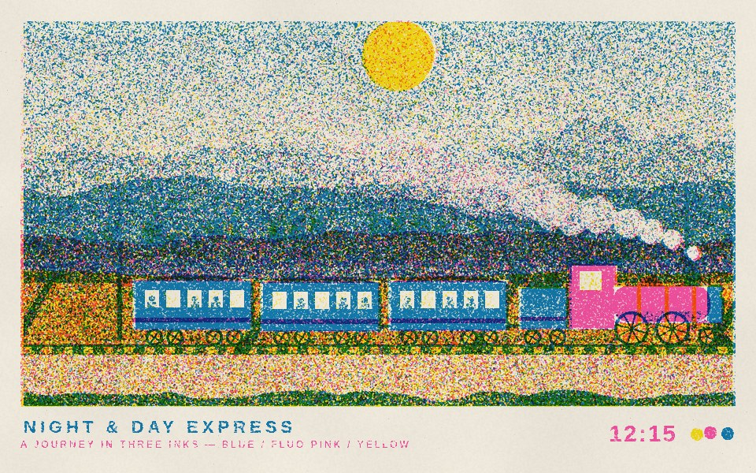
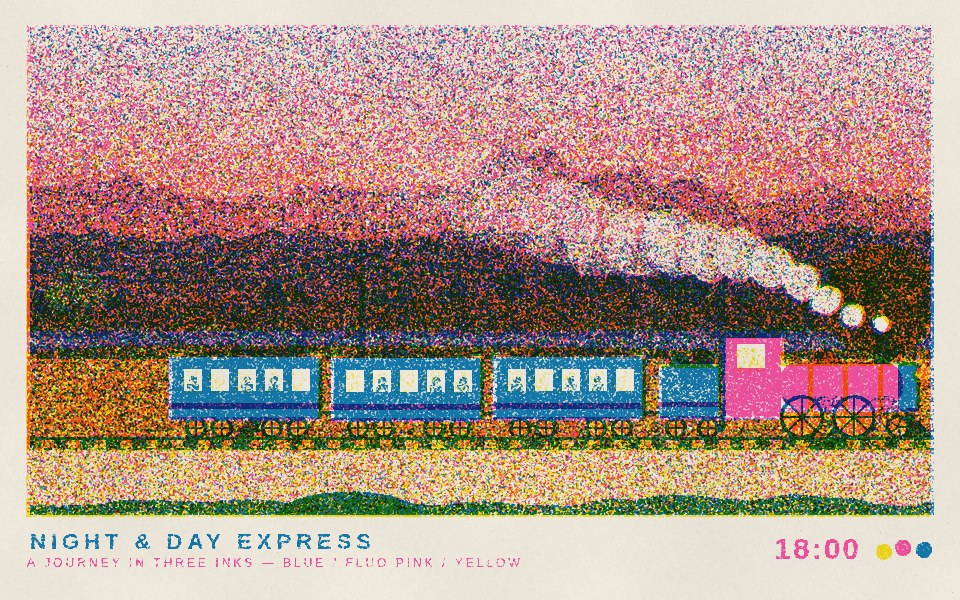
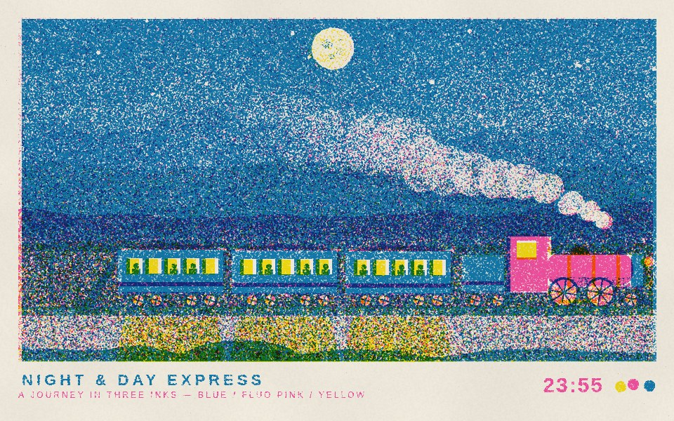
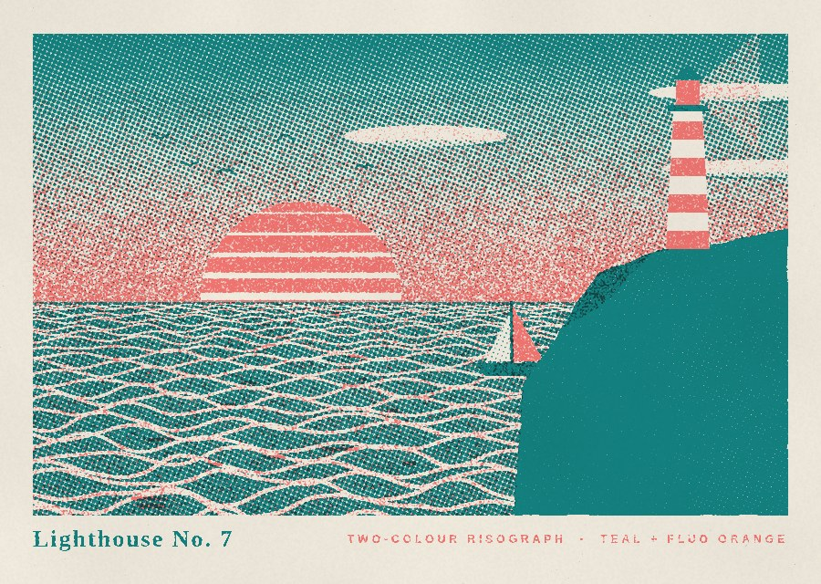

# riso animations

Animated risograph-style prints made from a single HTML file of plain JavaScript,
built so that you (or Claude) can **one-shot** a new piece: describe a scene,
get a looping animation that looks like it came off a riso drum.



| | |
|---|---|
|  |  |
|  | |

## How it works

`riso/riso.js` (~600 lines, no dependencies) simulates the print process:

- every ink is its own **plate**, a canvas you draw on in black and grey tints;
- each plate is **screened** (stochastic grain, halftone dots or lines, per-ink angle);
- ink is laid down **unevenly** (blotches, roller streaks);
- plates are **misregistered** and gently "boil" from frame to frame;
- plates are **multiplied** over textured paper, so overlapping inks mix like real ink.

A scene is just `(inks, t) => { ...canvas drawing... }`.

## Usage

```sh
open scenes/train-journey.html            # or: npm run serve → http://localhost:5173
```

Keys: **space** pause · **s** save PNG · **r** record a loop to WebM · **← →** scrub.

```sh
npm install                                                     # playwright, for headless renders
node scripts/render.mjs scenes/train-journey.html --poster 300 --jpg   # a still
node scripts/render.mjs scenes/train-journey.html --seconds 48 --mp4  # frames (+ mp4 if ffmpeg is on PATH)
node scripts/build.mjs                                          # dist/*.html, single self-contained files
```

## Making a new one

Start from `scenes/_template.html`. [`CLAUDE.md`](CLAUDE.md) documents the medium —
plates, overprinting, knockouts, seamless loops, ink sets — so a prompt like

> make a riso animation of a night market in the rain, three inks

is enough for Claude Code to produce, render, check and commit a new scene.

## Scenes

- `scenes/train-journey.html` — *Night & Day Express*: a 48 s seamless loop through a full
  day in blue / fluorescent pink / yellow. Parallax mountains, hills, fields, telegraph
  wires, steam that knocks out to bare paper, lit windows at night.
- `scenes/lighthouse.html` — *Lighthouse No. 7*: a 12 s two-colour loop, teal halftone +
  fluorescent orange grain, striped sunset, sweeping beam.
